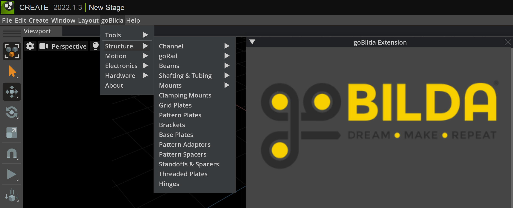

## NVIDIA Omniverse GoBilda Extension

The NVIDIA Omniverse GoBilda Extension is a work-in-progress open source extension that aims to provide universal scene description components for the GoBilda platform. The extension is designed to assist students, engineers, and educators in building prototypes of robots by offering a physics environment and useful metrics such as cost.

### Features

- Universal scene description components for the GoBilda platform
- Import GoBilda parts into your Omniverse scene
- Get information about the assembly and useful metrics such as cost
- Simulate the assembly using the physics environment in NVIDIA Omniverse
- Save time and money by ensuring part compatibility through simulation

### Usage

1. Enable the extension by following the instructions in the README.
2. Use the file menu bar to navigate to "goBilda > *part category* " and select a part to add it to the scene.
3. After you have setup your assembly, use the file menu bar to navigate to "goBilda > tools > stage info window" to view useful information about the assembly such as total cost or weight.
4. Explore the GoBilda menu to access additional information about the scene such as enabling viewport widgets.
5. Customize individual parts by adding physics, materials, and attributes that might be useful for your particular project.
6. Explore the python classes included in the repo that are currently used to author variant and variant sets for the GoBilda parts.
8. Update or import a new STEP file for a part by using the import STEP file option in the GoBilda menu.

### Requirements

- NVIDIA Omniverse

### Installation

The installation steps will be provided in the completed README once the extension is finished.

**Note:** This extension is currently a work-in-progress, and additional features and documentation will be added in future updates.

---

**Note to developers:** Please check out the repo to see source code, examples or if you would like to contribute.
